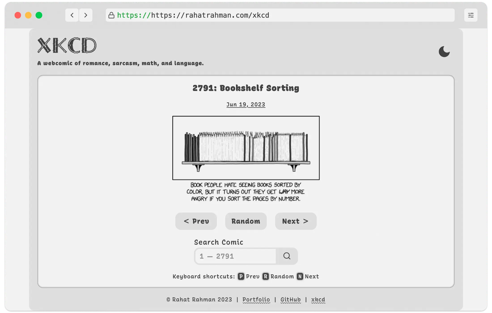
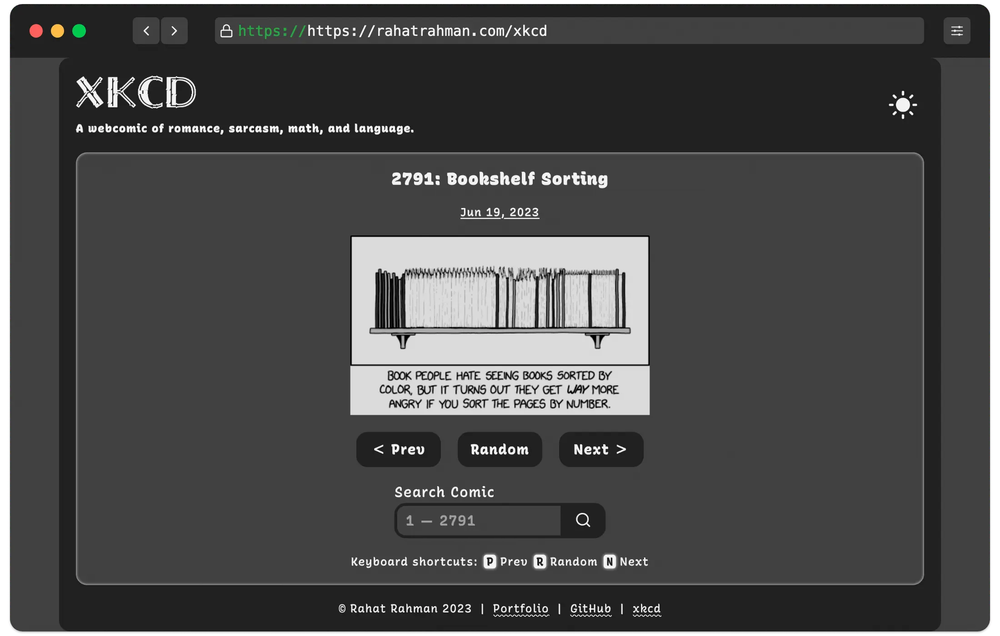
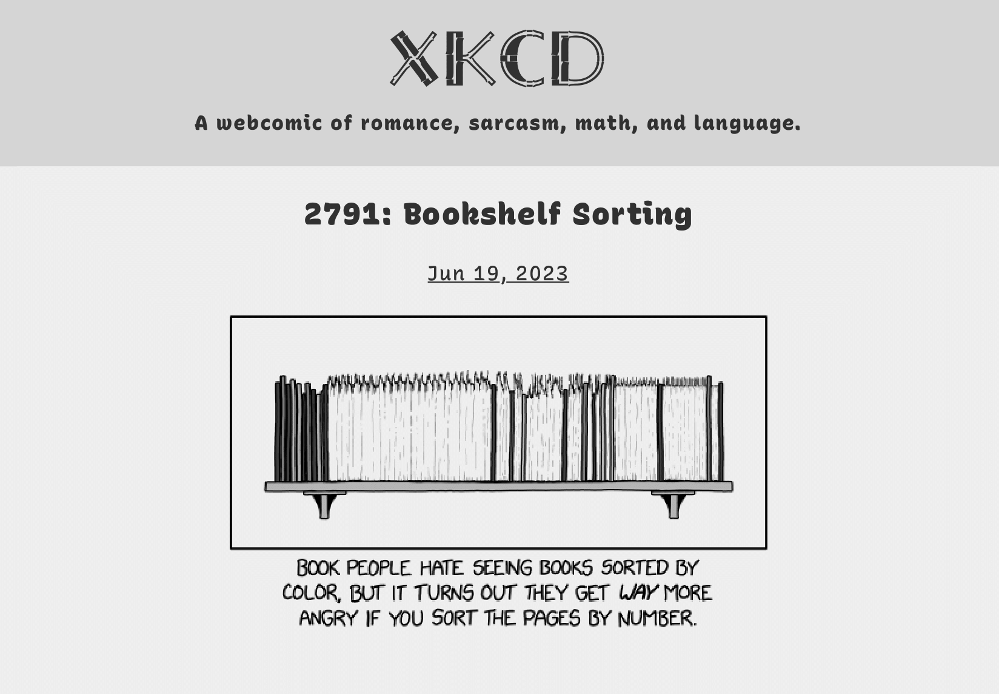

# [xkcd](https://rahatrahman.com/xkcd)

A vanilla JavaScript xkcd comics site built using the official [xkcd API](https://xkcd.com/json.html). Navigate to the next or previous comic, or view xkcd comics randomly. Search for any previous comic, including 404!

__Feature Highlights:__
* Keyboard accessible
* Responsive design
* Light and dark theme
* Printer friendly

__Code Highlights:__
* [modern-normalize v2.0.0](https://github.com/sindresorhus/modern-normalize)
* [minireset v0.0.6](https://github.com/jgthms/minireset.css)
* Self-hosted variable fonts
* CSS logical properties
* prefers-reduced-motion fallback
* Input validation
* Error handling
* noscript fallback
* Debounce keyboard input
* Sanitization to prevent XSS attacks
* JSDoc comments

## Languages

## Light Theme

## Dark Theme

## Print Preview

---
&copy; Rahat Rahman 2024